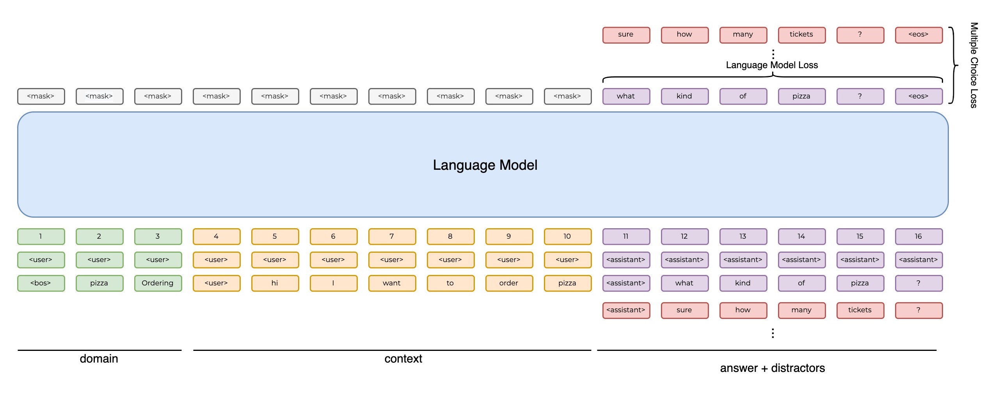

# State-of-the-art Conversational AI

This code is inspired on the [transfer-learning-conv-ai](https://github.com/huggingface/transfer-learning-conv-ai) repo from Hugging Face. Please check the accompanying blog post [How to build a State-of-the-Art Conversational AI with Transfer Learning](https://medium.com/huggingface/how-to-build-a-state-of-the-art-conversational-ai-with-transfer-learning-2d818ac26313).

# Model Architecture

We provide two different models: The **AssistantGPT2** and the **AssistantT5**.

Both models are trained in a multitask setting where we minimizie the following losses:
- Reply Language Modeling: we project the hidden-state on the word embedding matrix to get logits and apply a cross-entropy loss on the portion of the target corresponding to the gold reply.
- Next-sentence prediction: we pass the hidden-state of the last token (the end-of-sequence token) through a linear layer to get a score and apply a cross-entropy loss to classify correctly a gold answer among distractors.

Yet, while the **AssistantGPT2** is a decoder only model trained on top of a pretrained GPT2, the **AssistantT5** is a encoder-decoder model trained on top of a pretrained T5.

## Decoder Model
<div style="text-align:center"></div>

This model is built on top of a pretrained GPT2 model and its is trained in a multi-task setting where we minimize the following losses:


## Encoder-Decoder Model
<div style="text-align:center"></div>

## Install:

```bash
virtualenv -p python3.6 convai-env
source convai-env/bin/activate

git clone https://github.com/ricardorei/lightning-convai
cd lightning-convai
pip install -r requirements.txt
```

## Command Line Interface:

### Train:

To set up your training you have to define your model configs. Take a look at the `example.yaml` in the configs folder, where all hyperparameters are briefly described.

After defining your hyperparameter run the following command:
```bash
python cli.py train -f configs/example.yaml
```

### Monitor training with Tensorboard:
Launch tensorboard with:

```
tensorboard --logdir="experiments/"
```

### Test:

To test your model ability to rank candidate answers and reply to user questions just run the following command:

```bash
python cli.py test --experiment experiments/{experiment_id}/ --test_set data/personachat_val.json
```

where `experiment_id` is the name of the experiment folder containing the model you want to test.

```
Options:
  --experiment PATH    Path to the experiment folder containing the checkpoint
                       we want to interact with.  [required]

  --test_set PATH      Path to the json file containing the testset.
                       [required]

  --cuda / --cpu       Flag that either runs inference on cuda or in cpu.
                       [default: True]

  --seed INTEGER       Seed value used during inference. This influences
                       results only when using sampling.

  --sample / --search  Flag that either runs Nucleus-Sampling or Beam search.
                       [default: True]

  --top_p FLOAT        Nucleus filtering (top-p) before sampling (<=0.0: no
                       filtering)

  --temperature FLOAT  Use temperature to decrease the sensitivity to low
                       probability candidates when sampling.

  --num_beams INTEGER  Number of beams during search.
  --to_json TEXT       Creates and exports model predictions to a JSON file.
                       [default: False]

  --help               Show this message and exit.
```

### Code Style:
All the code follows the same style we use Black.

